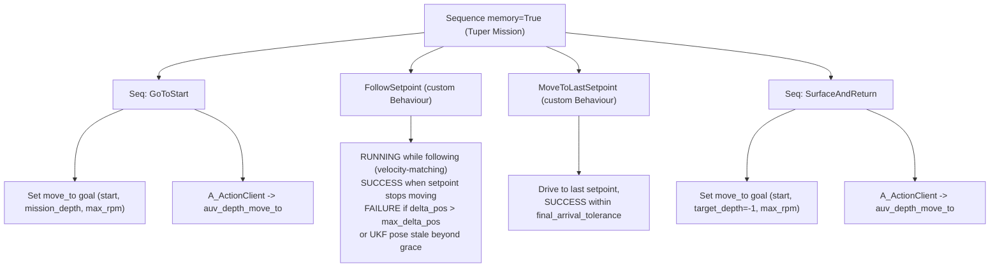

# lolo_tuper

LoLo's **TUPER** behaviour: an action server whose execution *is* a behaviour
tree. LoLo dives to a mission depth, follows an acoustically-estimated setpoint
that tracks a pair of leader vehicles, and surfaces/returns home once the
leaders stop.

It follows the same "action-server-as-a-BT" pattern as
[`alars_bt`](../../alars/alars/alars_bt.py): a single
[`GentlerActionServer`](../../smarc/smarc_action_base/smarc_action_base/gentler_action_server.py)
(a `smarc_msgs/action/BaseAction` server taking a JSON goal) whose loop ticks a
[`py_trees`](https://py-trees.readthedocs.io/) `BehaviourTree` at a fixed rate.
**No other action-server base class is used.**

---

## Mission



1. **GoToStart** - delegate to the external `auv_depth_move_to`
   ([`lolo_depth_move_to`](../lolo_depth_move_to)) action to reach the start
   position at `mission_depth`. Returns immediately if already within tolerance.
   Uses `max_rpm` so LoLo transits briskly to catch up with the leaders.
2. **FollowSetpoint** - two phases sharing one COURSE control loop:
   - **Bootstrap (onboard nav).** Before the UKF is live, LoLo steers toward the
     goal's `initial_setpoint` using her **own** navigation (`smarc/latlon` for
     position, `smarc/odom` for ENU heading), diving toward `mission_depth` so
     she submerges and acoustic comms / the UKF can come up. No divergence or
     staleness gating applies here - she is explicitly running without the UKF.
     The Unity odom frame is translation-only vs UTM, so the odom yaw is the same
     ENU heading the UTM control loop expects.
   - **UKF follow.** Once the UKF pose **and** setpoint are both fresh (latched),
     control hands over to the **velocity-matching** law (feed-forward to the
     leader's speed + light along-track standoff correction + a slow trim on
     measured speed; see [Control law](#control-law-velocity-matching)), tracking
     the live UKF setpoint at `mission_depth` behind a min-altitude floor.
   - After handover, a UKF dropout no longer reverts to bootstrap: it holds, then
     fails the task if the pose stays stale beyond the grace period.
   - Fails the whole task if the estimate's measured divergence from truth
     (`/follower/ukf/delta_pos`) exceeds `max_delta_pos`. This gates on the
     **actual** position error, not the filter's self-reported covariance, so a
     confidently-wrong UKF still fails. When no truth (and thus no `delta_pos`)
     is available, divergence is unknown and this check is skipped.
   - Succeeds when the setpoint has stopped moving (leaders done).
3. **MoveToLastSetpoint** - settle on the last known setpoint within
   `final_arrival_tolerance` (still UKF-based, since onboard nav is unreliable
   underwater).
4. **SurfaceAndReturn** - delegate to `auv_depth_move_to` with
   `target_depth = -1` to surface and return to the start position.

If any phase fails, the action aborts (`success = False`). On success, abort, or
cancel, the internal vehicle goal is reset so LoLo stops receiving course
commands from this node.

---

## Why a COURSE goal (and no TF)

Steering is computed entirely in absolute UTM from the estimator's own outputs:

```
bearing_enu = atan2(north_setpoint - north_pose, east_setpoint - east_pose)
```

This bearing is handed to the `Lolo` vehicle object as a **COURSE** goal
(`yaw_enu`), so heading, distance-to-setpoint, divergence gating and
stop-detection all live in one consistent UKF/UTM world with no TF lookups. The
depth + min-altitude floor is delegated to `Lolo.control_depth()`, which already
implements `min(goal.depth, (depth + altitude) - goal.min_altitude)` - the same
logic as the cruise-depth-at-heading server.

---

## Inputs (from the external estimator)

Produced by a **separate** estimator package (e.g. `acoustic_ekf_pkg`); this
node only subscribes. `/follower/ukf/pose` is the single source of truth.

| Topic (default)            | Type                                        | Used for |
|----------------------------|---------------------------------------------|----------|
| `/follower/ukf/pose`       | `geometry_msgs/PoseWithCovarianceStamped`   | Position (absolute UTM, frame `utm`) and heading (ENU yaw in orientation `z,w`). The covariance block is no longer used for gating. |
| `/follower/ukf/setpoint`   | `geographic_msgs/GeoPoint`                  | Desired follower position (lat/lon). Has **no header**, so it is timestamped on arrival. |
| `/follower/ukf/delta_pos`  | `std_msgs/Float32`                          | Measured divergence (m) of the estimate from a known truth. Drives the failure gate. Has **no header**, so it is timestamped on arrival; only published when a truth is available. |

`navsatfix` is intentionally **ignored** (it is the same follower position as the
pose, but without covariance).

**Divergence metric:** the measured distance (m) between the UKF estimate and the
known truth, published directly by the estimator on `/follower/ukf/delta_pos`.
The task fails when a fresh sample exceeds `max_delta_pos`, regardless of the
filter's self-reported covariance. A stale/absent sample means divergence is
unknown (no truth), and the gate is skipped rather than failing.

**Stop detection:** the setpoint is "stopped" (leaders done) only when, over the
full `setpoint_stop_period` of fresh, continuously-received samples, **both**:
its least-squares ground **speed is below `setpoint_stop_speed`** *and* every
sample lies within `setpoint_stop_tolerance` of the window centroid. The speed
gate is the decisive one: a centroid-radius-only test is, for steady motion,
equivalent to a speed threshold of `~2 * tolerance / period` (5 m / 30 s ~=
0.33 m/s), so a leader merely cruising slowly around a corner used to trip a
false stop and send LoLo home early. Keep `setpoint_stop_speed` well below the
leaders' cruise speed. Requiring *fresh* samples prevents a comms dropout from
masquerading as "leaders done".

**Mission timer:** the BT owns one authoritative clock for the whole task. It
starts when execution begins and **fails the mission** as soon as `timeout` is
exhausted (so the task budget is actually respected). The delegated `move_to`
legs (GoToStart / SurfaceAndReturn) are handed only the *remaining* budget, so a
return leg can never silently overrun the mission `timeout`. Set `timeout`
generously (e.g. ~2000 s) to cover a long follow plus the surface return.

---

## Outputs

Drives a `virtual_lolo` `Lolo` object during the follow phase, which publishes
the usual LoLo setpoints (RPM / yaw / roll / depth) on `lolo_msgs` topics. The
GoToStart and SurfaceAndReturn legs are actuated by the external
`auv_depth_move_to` server, not by this node directly.

Telemetry topics (all `std_msgs/String`):

| Topic | Rate | Contents |
|-------|------|----------|
| `lolo_tuper/status`       | 1 Hz | Human-readable status (BT tip + follower-state summary). |
| `lolo_tuper/telemetry`    | control rate (~10 Hz) | **Structured JSON**, one line per control tick: `t, phase, tip, dist, fwd_err, heading_err_deg, v_leader, v_target, v_meas, rpm_desired, rpm_cmd, rpm_floor, dive_state, under_dive, sigma, pose_fresh, setpoint_fresh, reason`. Record this to make a bag self-analysing (no lossy regex on the human status). |
| `lolo_tuper/goal_params`  | latched (on goal accept) | **Transient-local JSON** with the resolved per-run `{goal, gains}`, so every bag self-documents the parameters actually used. |

---

## Goal (per-mission JSON)

The action is `smarc_msgs/action/BaseAction`; the goal payload is a JSON string
in `goal.data`. Required fields are presence-checked on receipt; the few tunable
fields have defaults.

| Field                      | Required | Default | Units / meaning |
|----------------------------|:--------:|:-------:|-----------------|
| `start_position`           | yes      | -       | `{latitude, longitude}` - start AND return point. |
| `initial_setpoint`         | yes      | -       | `{latitude, longitude}` - point/direction LoLo dives toward on onboard nav until the UKF is live. |
| `mission_depth`            | yes      | -       | m, positive down; held through the dive. |
| `min_altitude`             | yes      | -       | m; seabed safety floor (>= vehicle min, default 1 m). |
| `setpoint_stop_tolerance`  | yes      | -       | m; radius the setpoint must stay within to count as stopped. |
| `setpoint_stop_period`     | yes      | -       | s; duration of fresh in-radius samples to declare a stop. |
| `setpoint_stop_speed`      | no       | node    | m/s; fitted setpoint speed below which (together with the radius test) the leaders count as stopped. Keep well below cruise. |
| `arrival_tolerance`        | yes      | -       | m; **follow-phase** closeness tolerance — the fixed deadband radius within which she eases to the RPM floor. Keep small (~1–2 m) for a tight follow; this does **not** affect the final settle. |
| `final_arrival_tolerance`  | no       | node (10) | m; radius to consider the **last (stopped) setpoint** reached. Separate from (and larger than) `arrival_tolerance`: LoLo can't stop and has a finite turn radius, so she cannot sit on a static point — a roomy value lets her finish on the first pass instead of orbiting. |
| `start_tolerance`          | yes      | -       | m; tolerance for the move_to legs. |
| `timeout`                  | yes      | -       | s; **whole-mission** budget. The BT fails the task when it elapses and hands each move_to leg only the remaining time. Set generously (~2000 s). |
| `min_rpm`                  | no       | 400     | Commanded RPM floor while tracking. Also the eased RPM inside the deadband / during a come-about toward a target abaft the beam, and the floor once she is at depth. The dive floor (below) can raise the *effective* floor during the descent. |
| `max_rpm`                  | no       | 700     | RPM saturation / catch-up cap; also used for the transit (move_to) legs. **This is what bounds the follow speed** (the loop has no separate speed clamp). |
| `max_delta_pos`            | no       | 5.0     | m; fail the task if the estimate's measured divergence from truth (`/follower/ukf/delta_pos`) exceeds this. Gates on the actual error, not the covariance. Skipped when no truth is available. |
| `standoff_distance`        | no       | node    | m; desired trailing gap kept *behind* the moving setpoint (see Control law). `0` = sit on it. |
| `dive_entry_rpm`           | no       | node    | **Dive boost.** RPM floor used the whole way down (surface → mission depth) so she punches through to depth, then releases to `min_rpm` once at depth. May exceed `max_rpm` (bounded only by the vehicle's hard `max_thruster_rpm`) so you can dive faster than you cruise. If `max_rpm >= dive_entry_rpm` it has no extra effect — she can already use `max_rpm` to dive. |

The optional fields (`no` in the *required* column) fall back to their node-param
values ([`config/lolo_tuper_params.yaml`](config/lolo_tuper_params.yaml)) when omitted.
Precedence is **goal JSON > node param > built-in default**. Per the field team's
guidance the loop is bounded by RPM limits (`min_rpm` / `max_rpm` / the dive
floors), *not* by an explicit speed clamp.

### Example (essential params only)

The smallest valid goal: just the nine required fields. Everything else
(`min_rpm`, `max_rpm`, `max_delta_pos`, `standoff_distance`,
`dive_entry_rpm`, `setpoint_stop_speed`, `final_arrival_tolerance`) falls back to
the node params in [`config/lolo_tuper_params.yaml`](config/lolo_tuper_params.yaml).

```json
{
  "start_position":   {"latitude": 58.8403858, "longitude": 17.6516642},
  "initial_setpoint": {"latitude": 58.8409250, "longitude": 17.6527070},
  "mission_depth": 10.0,
  "min_altitude": 5.0,
  "setpoint_stop_tolerance": 5.0,
  "setpoint_stop_period": 30.0,
  "arrival_tolerance": 2.0,
  "start_tolerance": 5.0,
  "timeout": 2000.0
}
```

### Example (all params, annotated)

Every overridable knob spelled out. Comments are explanatory only — strip them
for real JSON.

```jsonc
{
  // --- geometry (required) ---
  "start_position":   {"latitude": 58.8403858, "longitude": 17.6516642}, // start AND return point
  "initial_setpoint": {"latitude": 58.8409250, "longitude": 17.6527070}, // bootstrap target until live UKF
  "mission_depth": 10.0,          // m down, held through the dive
  "min_altitude": 5.0,            // m seabed safety floor
  // --- stop / arrival detection (required) ---
  "setpoint_stop_tolerance": 5.0, // m radius the setpoint must stay within ...
  "setpoint_stop_period": 30.0,   // ... for this long to count as "leaders done"
  "arrival_tolerance": 2.0,       // m follow closeness (deadband floor) - keep small
  "start_tolerance": 5.0,         // m tolerance for the move_to legs
  "timeout": 2000.0,              // s whole-mission budget (BT fails on elapse; legs get the remainder)
  // --- RPM bounds (optional; these bound the follow speed) ---
  "min_rpm": 400.0,               // commanded RPM floor while tracking / at depth
  "max_rpm": 700.0,               // catch-up + cruise cap; ~1.1 m/s territory (see calibration)
  // --- safety / following behaviour (optional; omit to use node defaults) ---
  "max_delta_pos": 5.0,           // m; fail if measured divergence from truth exceeds this
  "setpoint_stop_speed": 0.1,     // m/s; leaders "done" only below this fitted speed
  "standoff_distance": 5.0,       // m trailing gap behind the setpoint (0 = sit on it)
  "final_arrival_tolerance": 10.0,// m to consider the last (stopped) setpoint reached
  "dive_entry_rpm": 550.0         // RPM "dive boost" floor used the whole way down;
                                  // may exceed max_rpm (capped at the vehicle limit)
}
```

> **Dive boost.** `dive_entry_rpm` only matters when you need to dive *harder*
> than you cruise. If `max_rpm >= dive_entry_rpm` she already uses `max_rpm` to
> descend, so the value is a no-op. Set `dive_entry_rpm` above `max_rpm` (e.g.
> `max_rpm: 450`, `dive_entry_rpm: 550`) to punch down to depth, then hold at
> `min_rpm` once there. The only hard ceiling is the vehicle's
> `max_thruster_rpm`.

Send it (note the JSON is a string inside `goal.data`):

```bash
ros2 action send_goal /lolo/lolo_tuper smarc_msgs/action/BaseAction \
  "{goal: {data: '{\"start_position\":{\"latitude\":58.8403858,\"longitude\":17.6516642},\"initial_setpoint\":{\"latitude\":58.8409250,\"longitude\":17.6527070},\"mission_depth\":10.0,\"min_altitude\":5.0,\"setpoint_stop_tolerance\":5.0,\"setpoint_stop_period\":30.0,\"arrival_tolerance\":2.0,\"start_tolerance\":5.0,\"timeout\":2000.0}'}}" \
  --feedback
```

---

## Node parameters (tuning constants)

Set in [`config/lolo_tuper_params.yaml`](config/lolo_tuper_params.yaml). These are
*node-level* knobs (not per-mission).

| Parameter                 | Default              | Meaning |
|---------------------------|----------------------|---------|
| `robot_name`              | `lolo`               | Passed to the `Lolo` vehicle object. |
| `limits_filename`         | `""`                 | Vehicle limits YAML; empty -> `virtual_lolo` default. |
| `control_frequency`       | `10.0`               | BT / control loop rate (Hz); also the `GentlerActionServer` loop frequency. |
| `estimate_max_age`        | `5.0`                | s; UKF pose/setpoint older than this is "stale". |
| `stale_grace_period`      | `10.0`               | s; how long a stale pose is tolerated (holding) before failing. |
| `pose_topic`              | `/follower/ukf/pose` | Estimator pose topic. |
| `setpoint_topic`          | `/follower/ukf/setpoint` | Estimator setpoint topic. |
| `odom_topic`              | `smarc/odom` | Onboard odometry (ENU heading source for the bootstrap phase). |
| `latlon_topic`            | `smarc/latlon` | Onboard lat/lon (position source for the bootstrap phase). |
| `move_to_action_name`     | `auv_depth_move_to`  | External depth-move-to action name. |
| `rpm_idle`                | `0.0`                | Feed-forward intercept: `rpm = rpm_idle + rpm_per_mps * v_target`. |
| `rpm_per_mps`             | `530.0`              | Feed-forward slope (RPM per m/s of target speed). ~`1/0.0019` from the field RPM->speed fit; the slow trim absorbs the ctrl-setpoint -> thruster-RPM offset. |
| `kp_pos`                  | `0.15`               | Along-track position -> extra target speed (m/s per metre beyond the standoff). Higher closes the trailing gap faster (bounded by `max_rpm`). |
| `setpoint_stop_speed`     | `0.1`                | m/s; fitted-speed gate for stop detection (fallback when omitted from the goal). |
| `ki_speed`                | `20.0`               | Slow integral trim on **measured** speed (RPM per (m/s . s)). |
| `speed_trim_limit`        | `150.0`              | Clamp on the speed-trim contribution (RPM). |
| `hold_rpm`                | `400.0`              | Safe RPM while waiting / stale (clamped not below mission `min_rpm`, then dive-floored). |
| `heading_gate_deg`        | `60.0`               | Telemetry only: above this `|bearing - heading|` the `reason` field is tagged `turning` (a come-about is in progress). Control is pure pursuit, so this no longer gates behaviour. |
| `delta_pos_topic`         | `/follower/ukf/delta_pos` | Estimator divergence topic (`std_msgs/Float32`); failure gate source. |
| `leader_speed_window`     | `5.0`                | s; window for the least-squares leader-velocity estimate. |
| `submersion_min_depth`    | `0.5`                | m; a `mission_depth` deeper than this means "submersion required" (engages the dive floor). |
| `dive_depth_tolerance`    | `1.5`                | m; "at depth" band below `mission_depth`. The dive-entry floor releases (drops to `min_rpm`) only once `depth >= mission_depth - this` (entry RPM the whole way down). Also the under-dive band. |
| `dive_warn_period`        | `20.0`               | s; under-dive watchdog trips if depth stays shallower than `mission_depth - dive_depth_tolerance` for this long (warn-only; sets the telemetry `under_dive` flag, never fails). |
| `standoff_distance` / `dive_entry_rpm` | `5.0 / 550` | Node fallbacks for the goal-JSON-overridable knobs above. |

### Control law (velocity-matching)

Because LoLo's speed responds slowly (saturation `τ ≈ 12 s`, see calibration),
reacting to *distance* always lags a moving setpoint. Instead we command the RPM
for the **leader's current speed** (feed-forward) and only trim from there.

```
v_leader     = least-squares slope of the recent UKF setpoint history  (m/s)
fwd_err      = projection of (setpoint - pose) onto LoLo's heading      (m)
standoff     = desired trailing gap behind the setpoint                 (m)
deadband     = arrival_tolerance           # fixed; NOT widened by delta_pos

if dist <= deadband:                       # settled: don't chase estimator jitter
    yaw = hold heading ; rpm = min_rpm
else:                                       # pure pursuit + velocity matching
    yaw      = bearing to target            # ALWAYS steer straight at the target
    v_target = max(0, v_leader + kp_pos * (fwd_err - standoff))
    rpm      = (rpm_idle + rpm_per_mps * v_target)        # feed-forward
             + speed_trim                                  # slow ∫(v_target - v_meas)

rpm = dive_floor(rpm)                       # hysteresis: max(rpm, entry/hold floor)
rpm = clip(rpm, min_rpm, max_rpm)           # RPM bounds = the only speed bound
```

**Why pure pursuit (and not "hold heading and wait"):** LoLo cannot stop — the
dive floor keeps her at `min_rpm` (~0.6 m/s) the entire mission. Any heuristic
that holds the current heading when the target is off to the side or behind has a
lock state: she just motors *past/away* from the target forever while the
setpoint sits on her beam, and the gap grows without bound (seen blowing up to
100–200 m in sim). So we always steer straight at the target. The position term
uses `fwd_err` (the along-heading projection), which is small or negative while
she is still swinging onto the bearing, so `v_target` collapses to the floor and
she comes about nearly in place; once pointed at the target it grows to the
leader's speed and she closes the gap. No angle threshold, no lock state.

Key behaviours:

- **Steady follow:** when `fwd_err == standoff` the position term is zero, so
  `v_target == v_leader` — she paces the leader and holds the gap.
- **Caught-up / overrun:** if she gets ahead (`fwd_err < standoff`), `v_target`
  drops below leader speed toward `min_rpm`, so she eases off and lets the
  setpoint pull back out. If she fully overruns (`fwd_err < 0`, target abaft the
  beam) she turns toward it at the floor RPM — a tight, slow come-about rather
  than a wide, fast circle.
- **Catch-up:** far back, `v_target` is large and the feed-forward saturates at
  `max_rpm`. `max_rpm` is therefore the catch-up reserve **and** the top-speed cap.
- **Slow trim** on measured speed (`Lolo.vx`) corrects the (non-1:1) commanded
  `ctrl/rpm_setpoint` -> thruster-RPM gap, so `rpm_per_mps` only needs to be
  approximately right.
- **Deadband widens with measured divergence,** so an estimate drifting from
  truth produces calm behaviour rather than wiggling (until it trips the
  `max_delta_pos` failure).

### Dive-floor

LoLo needs more thrust to **get down** than to **hold station** at depth. The
follow loop can otherwise drop RPM (deadband / come-about / hold) low enough
that she silently under-dives or surfaces while the BT still thinks she is at
depth. So every commanded RPM is floored by a two-state machine — **switched
relative to the mission depth, not a fixed shallow threshold**, so the descent
is never cut short a metre or two down:

```
submersion_required = mission_depth > submersion_min_depth
band     = dive_depth_tolerance
enter_at = mission_depth - band         # reached cruising depth
exit_at  = mission_depth - 2*band       # fell out of it (hysteresis)

descending --(depth >= enter_at)--> at_depth     floor = dive_entry_rpm (descending)
at_depth   --(depth <  exit_at )--> descending          = min_rpm       (at_depth)
effective floor = max(min_rpm, that floor)   # capped at the vehicle max_thruster_rpm
```

So `dive_entry_rpm` is held the **whole way down** (surface through descent) and
releases to the ordinary `min_rpm` once she is within `dive_depth_tolerance` of
the commanded depth; the `2*band` exit gives a hysteresis band so the floor does
not chatter. Because the dive floor may exceed `max_rpm` (a *dive boost*, bounded
only by the vehicle's `max_thruster_rpm`), you can descend faster than you
cruise. A **warn-only** watchdog logs (and flags `under_dive` in telemetry) if
she stays shallower than `mission_depth - dive_depth_tolerance` for
`dive_warn_period` despite the floor — it never fails the mission.

---

## Calibration & operating envelope (Askö 2026 field data)

These numbers come from the multi-run deployment bag analysed in
[`notebooks/asko_2026_tuper_analysis.ipynb`](notebooks/asko_2026_tuper_analysis.ipynb)
(6 back-to-back TUPER runs with different RPM bands). Re-run that notebook on a new bag
to refresh them. **Caveat:** `smarc/speed` is roughly speed-over-ground, so the absolute
m/s values fold in any tide/current; treat them as a field-calibrated guide, not a tow-tank
spec. Relative comparisons (margins, "can she dive") are robust.

### Two RPM numbers — don't conflate them

- **`ctrl/rpm_setpoint`** — the high-level cruise RPM `lolo_tuper` commands (set by the
  goal's `min_rpm` / `max_rpm`; capped at 600 in these runs).
- **`actuators/thruster_{port,strb}_fb`** — the *measured* propeller RPM the low-level
  surge controller actually spins (up to ~840 here). **Physical speed depends on this**,
  and it is **not 1:1** with the high-level setpoint — a commanded cap of 600 drove the
  props to ~600–700 and produced ~1.0–1.1 m/s in the field.

### Physical RPM -> speed curve (authoritative)

Built from **all** bag data, **straight-line only** (`|yawrate| < 0.02 rad/s`, low port/strb
differential), **steady-state only** (RPM held several seconds so speed settled), against the
**measured thruster RPM**. Zero RPM must give zero speed, so the model is **linear through the
origin**:

```
v  ≈  0.0019 * rpm_thruster   [m/s]          rpm_thruster ≈ 528 * v
```

This is the physically expected form (propeller thrust ~ rpm², hull drag ~ v²  =>  v ~ rpm),
it fits as well as any free-exponent power law, and far better than a sqrt law. Fit on **2189
steady, straight-line samples** (thruster RPM 234–607):

| model                       | R²   | note |
|-----------------------------|------|------|
| **linear `v = 0.0019*rpm`** | 0.82 | use this — inverts trivially for feed-forward |
| power `v = 0.0029*rpm^0.93` | 0.82 | identical (exponent ≈ 1) |
| sqrt `v = 0.045*sqrt(rpm)`  | 0.66 | worst — biased low/high, do **not** use |

Validation vs binned steady medians (linear pred within ~0.05 m/s, residuals show no
curvature):

| thruster RPM | measured | linear pred |
|--------------|----------|-------------|
| 375          | 0.80     | 0.71        |
| 475          | 0.85     | 0.90        |
| 525          | 1.05     | 0.99        |
| 575          | 1.14     | 1.09        |
| 625          | 1.16     | 1.18        |

Lookup / feed-forward (`rpm_ff = v_desired * 528`):

| target speed | ~thruster RPM |   | thruster RPM | ~speed |
|--------------|---------------|---|--------------|--------|
| 0.5 m/s      | ~264          |   | 300          | 0.57   |
| 0.7 m/s      | ~370          |   | 400          | 0.76   |
| 0.8 m/s      | ~422          |   | 500          | 0.95   |
| 1.0 m/s      | ~528          |   | 600          | 1.13   |
| 1.1 m/s      | ~581          |   | 650          | 1.23   |

LoLo's **true top speed is ~1.1–1.2 m/s** — don't extrapolate the line past ~650 rpm, where
thrust saturates toward the ceiling.

### Speed responds slowly — saturation, τ ≈ 12 s

After an RPM step, speed reaches **63 % in ~12 s** and **~90 % in ~27 s** (first-order).
Consequences:

- Calibrate only on settled samples (done above); never on the ramp.
- **Reactive RPM ramping cannot chase a moving setpoint** — by the time speed responds the
  geometry has moved. This is the strongest argument for **velocity feed-forward** (command
  the RPM for the leader's speed *now*) plus patience, rather than high gains.
- Abrupt RPM changes => sluggish, laggy speed; keep commands smooth.

### Dive envelope — what RPM actually keeps her down

Following at a commanded `mission_depth` of ~2.5 m, the *achieved* depth depends on RPM
(the dive planes need flow):

| RPM band  | speed (m/s) | median depth reached (of 2.5 m) | submerged? |
|-----------|-------------|---------------------------------|------------|
| 250–300   | 0.55–0.60   | ~0.1 m                          | no — sits at surface |
| 300–350   | 0.60–0.65   | ~0.6 m                          | marginal |
| 400–450   | 0.69–0.73   | ~1.3 m                          | mostly yes |
| ≥ 550     | ≥ 0.81      | ~1.8 m (≈0.7 m shallow bias)    | yes |

So:

- **`min_rpm` 250–300 keeps her *moving* / barely wet, but will NOT reach a 2.5 m mission
  depth.** If the mission requires depth, the *effective* floor is **~450–550 rpm**.
- Even at high RPM there is a **persistent ~0.5–1 m shallow bias** (she under-dives the
  commanded depth) — budget for it, or look at the depth-controller / pitch authority.
- Depth-keeping is run-dependent (one run followed near the surface at ~450–500 rpm despite
  a deep command); see the per-run depth plots before trusting a single threshold.

### Keeping up with the leaders — margin, but don't starve `max_rpm`

The leaders did **not** move at a fixed speed across runs (~1.0 m/s in some, ~0.7 m/s in
others). LoLo's true top (~1.1–1.2 m/s) *can* match a ~1.0 m/s leader — **but only if the
commanded `max_rpm` cap lets the surge controller spin up**. The observed pattern:

| leader speed | commanded cap | result |
|--------------|---------------|--------|
| ~0.70 m/s    | 550 rpm       | +margin → tightest follow (~20 m lag) |
| ~0.70 m/s    | **450 rpm**   | cap-starved → falls behind (~67 m lag) |
| ~1.0 m/s     | 600 rpm       | speeds matched; residual lag is the **initial gap** |

Rules of thumb:

- **Don't starve `max_rpm`.** A 450-rpm cap held LoLo near the leader's own speed (zero
  margin). Give a commanded cap that yields **≥ ~0.15 m/s over the expected leader speed**
  (use the physical curve + remember the surge controller drives the props beyond the
  setpoint). With the velocity-matching law, a generous cap is safe — `v_target` (and
  hence RPM) collapses back toward `min_rpm` as `fwd_err` shrinks below the standoff, so
  she will not overshoot the setpoint.
- Because of the **~12 s speed lag**, the controller now matches the leader's *velocity*
  (feed-forward via `rpm_per_mps`) instead of reacting to distance; `max_rpm` mostly buys
  **catch-up** headroom, not steady-following speed.

### Operating cheat-sheet (commanded `min_rpm` / `max_rpm`)

| Goal                              | commanded RPM        |
|-----------------------------------|----------------------|
| Stay submerged & moving (shallow) | 300–350              |
| Reliably hold ~2 m mission depth  | 500–600              |
| Match a ~0.7 m/s leader (+margin) | 550–600              |
| Match a ~1.0 m/s leader           | 600 (do not cap lower) |
| Catch-up reserve (gated)          | 600 cap              |
| Surface transit (`target_depth=-1`)| set by `auv_depth_move_to` |

---

## Build & run

```bash
cd ~/colcon_ws
colcon build --packages-select lolo_tuper
source install/setup.bash
```

This node requires two things to be running:

1. the external `auv_depth_move_to` server (`lolo_depth_move_to`), and
2. the UKF estimator publishing the pose/setpoint topics.

`setup()` waits for the `auv_depth_move_to` server and aborts startup if it is
not found (you will see "Server not found ... shutting down").

Run via launch (puts the node in the robot namespace and loads the config):

```bash
ros2 launch lolo_tuper lolo_tuper.launch robot_name:=lolo
```

or directly:

```bash
ros2 run lolo_tuper lolo_tuper --ros-args --params-file \
  $(ros2 pkg prefix lolo_tuper)/share/lolo_tuper/config/lolo_tuper_params.yaml
```

---

## Testing in sim (the `tuper_test` faker)

`tuper_test` lets you dry-run the whole mission in simulation **without** the
real acoustic UKF. It fakes the two estimator inputs the BT consumes:

- After a configurable `warmup_seconds` (default 30 s) it starts publishing
  `/follower/ukf/pose`. It captures the vehicle's absolute UTM position **once**
  at activation (from `/lolo/smarc/latlon`) as an anchor, then tracks
  `/lolo/smarc/odom` displacement on top of it, plus an integrated random-walk
  noise; heading also comes from odom. Because it tracks the real (simulated)
  vehicle, the control loop actually closes.

  > **Why odom, not the live latlon?** In the SMARC sim, `/lolo/smarc/latlon` is
  > published through a Web-Mercator georeference that compresses ground motion by
  > ~`sec(latitude)` (~1.9x at Askö), so a pose built from the live latlon crawls
  > at roughly *half* the true hull speed and the follower can never keep up. odom
  > tracks the real hull motion and matches `/lolo/smarc/speed`. (On the real
  > vehicle latlon, odom, GPS and speed all agree, so this is sim-only.)
- Simultaneously it moves `/follower/ukf/setpoint` smoothly along a trajectory
  defined by vertices, at 0.5-0.8 m/s, slowing around corners, with occasional
  sideways jumps and along-track "runaway / snap-back" glitches that mimic UKF
  jumpiness. When the trajectory ends it holds the last vertex, so the BT's
  stop-detector fires and the mission proceeds to surface-and-return.

Everything is configured in
[`config/tuper_test_params.yaml`](config/tuper_test_params.yaml) - including the
noise model and the trajectory vertices, which can be given as `relative`
(east/north metres from the start, no GPS coords needed) or absolute `latlon`.

Run it (sim):

```bash
ros2 run lolo_tuper tuper_test --ros-args \
  --params-file $(ros2 pkg prefix lolo_tuper)/share/lolo_tuper/config/tuper_test_params.yaml \
  -p latlon_topic:=/<robot>/smarc/latlon -p odom_topic:=/<robot>/smarc/odom
```

`lolo_bringup.sh` already opens a `tuper` window that launches the BT server and,
in simulation, this faker alongside it. Trigger the mission as usual (GUI / MQTT
/ `ros2 action send_goal`) once the faker is publishing.

> Tip: the faker publishes a real `/follower/ukf/delta_pos` (the faked pose's
> distance from truth). Raise `pose_jump_std` (or lower the mission's
> `max_delta_pos`, default 5 m) so a pose jump pushes the divergence past the
> threshold and exercises the divergence-failure path.

## Layout

```
lolo_tuper/
├── config/
│   ├── lolo_tuper_params.yaml   # node tuning constants
│   └── tuper_test_params.yaml   # faker config (noise + trajectory vertices)
├── launch/lolo_tuper.launch
└── lolo_tuper/
    ├── follower_state.py        # subscriber/holder of UKF estimates (no estimation here)
    ├── tuper_behaviours.py      # FollowSetpoint, MoveToLastSetpoint, TuperGoal, ControlGains
    ├── tuper_test_node.py       # sim faker for /follower/ukf/pose + /setpoint + /delta_pos
    └── lolo_tuper_bt.py         # goal handling, BT assembly, GentlerActionServer, main
```

## Dependencies

`rclpy`, `smarc_action_base`, `smarc_msgs`, `virtual_lolo`, `geographic_msgs`,
`sensor_msgs`, `geometry_msgs`, `std_msgs`, `geodesy`, `numpy`, plus the BT stack
(`py_trees`, `wasp_bt`) used by `smarc_action_base`'s BT action client.

## Notes / current defaults

- "Move to last setpoint" uses the UKF course-control loop (not a `move_to`
  leg), because onboard nav is unreliable underwater.
- On a divergence failure the action simply aborts; there is no automatic
  emergency-surface here (left to the higher-level mission /
  `lolo_emergency_action`).
- Pose UTM and setpoint UTM are assumed to share one UTM zone (true for a single
  operating area).
